<div align="center">

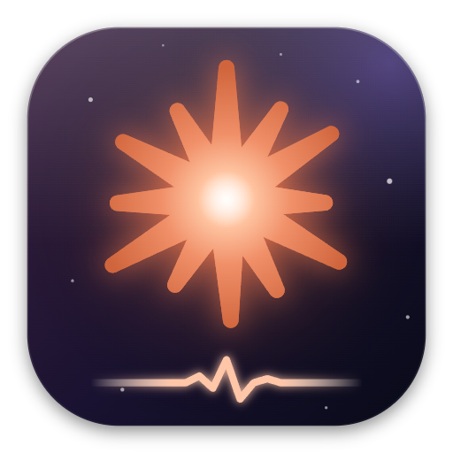

# TokenPulse

**Claude Code 与 Codex 的 Token 用量、费用和订阅额度，一眼看清。**

Windows 桌面应用 · 直接读取本机会话日志 · 无需账号、没有统计上报

[](https://github.com/Persusczz/TokenPulse/releases)

[](LICENSE)

[下载](#下载与安装) · [功能](#功能详解) · [主题](#主题包与动态背景) · [数据与隐私](#数据与隐私) · [本地开发](#本地开发) · [更新记录](#更新记录)

</div>

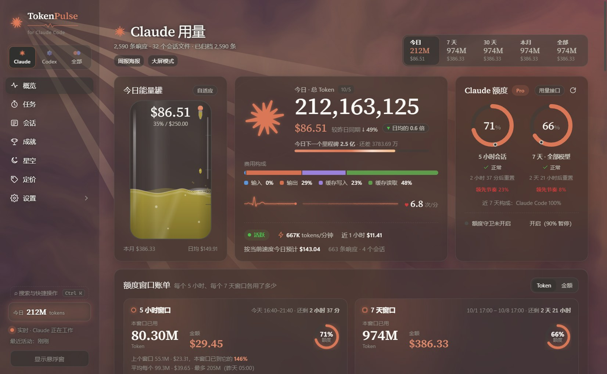

## 它能做什么

- **用量与费用**：今天、7 天、30 天、本月和全部记录的 Token 与等价 API 费用，拆成输入、输出、缓存写入、缓存读取，支持美元和人民币。
- **订阅额度**：Claude 和 Codex 各自的 5 小时、7 天额度，重置倒计时、领先或落后节奏、按当前速度预测何时用完；每个窗口用了多少 Token、花了多少钱都有账单。
- **额度守卫**：Claude Code 的 5 小时额度到阈值时暂停正在运行的任务，额度重置后自动继续。
- **刷新任务**：提前排好任务，在下次额度刷新时交给 Claude Code 或 Codex 无人值守执行，失败自动重试，检查命令不通过就接着修。
- **提醒与遥控**：预算、额度、额度浪费、上下文膨胀、失控会话提醒；可推送到 Telegram，并在 Telegram 里查看状态、排任务、暂停和恢复。
- **桌面常驻**：托盘、置顶悬浮窗（卡片 / 胶囊 / 圆球）、屏幕顶部的灵动岛、全屏大屏模式和动态桌面壁纸。
- **主题与动效**：30 个主题包，每个都有自己的动态背景、配色、字体和入场动效；昼夜主题跟着真实的太阳和二十四节气变化。

## 下载与安装

在 [Releases](https://github.com/Persusczz/TokenPulse/releases) 页面下载 Windows x64 版本：

| 文件 | 说明 |
| --- | --- |
| `TokenPulse.Setup.2.18.0.exe` | 安装版，可选择安装目录 |
| `TokenPulse-2.18.0-portable.exe` | 便携版，下载后直接运行 |

**使用前提**

- Windows 10 / 11 x64。
- 本机用过 Claude Code 或 Codex，留有会话日志。TokenPulse 会自动找到：
  - Claude Code：`CLAUDE_CONFIG_DIR`、`~/.claude`、`~/.config/claude` 下的 `projects` 目录；其他目录可在 **设置 → 系统与数据** 里添加。
  - Codex：`CODEX_HOME`，否则 `~/.codex`。
- 查看 Claude 订阅额度需要 Claude Code 已登录；运行刷新任务需要对应的 CLI（`claude` / `codex`）已安装并登录。

安装包没有代码签名，首次运行时 Windows SmartScreen 可能提示“已保护你的电脑”，点击 **更多信息 → 仍要运行** 即可。

打开后侧边栏顶部可以在 **Claude / Codex / 全部** 之间切换：两个工具各有自己的图标、配色和额度，只有在“全部”里才合并显示。

## 功能详解

### 用量概览

<table>
  <tr>
    <td>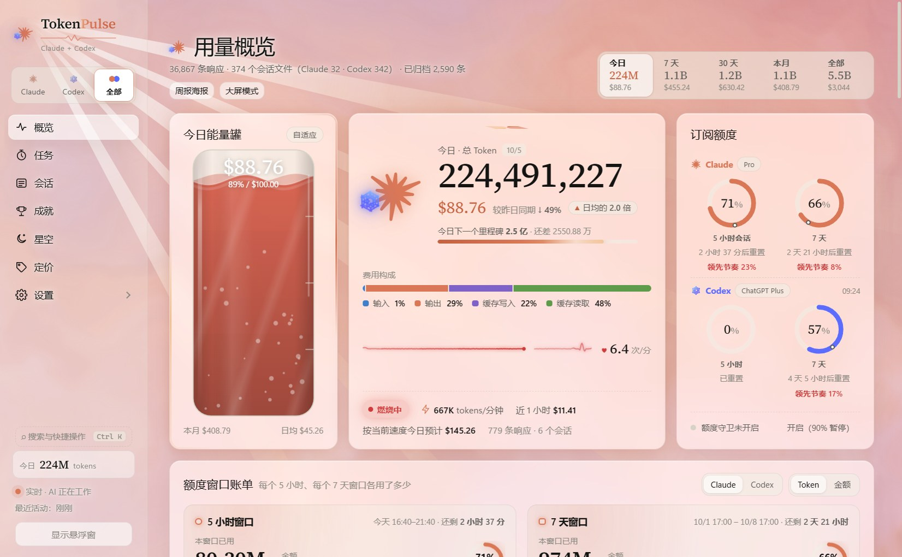</td>
    <td>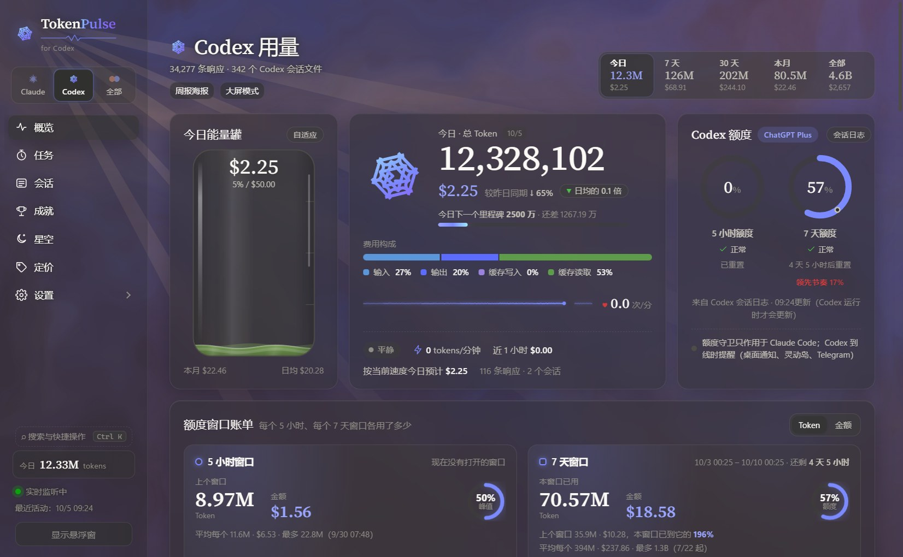</td>
  </tr>
  <tr>
    <td align="center">浅色主题 · Claude + Codex 合并视图</td>
    <td align="center">Codex 视图</td>
  </tr>
</table>

- 右上角切换 **今日 / 7 天 / 30 天 / 本月 / 全部**，每格同时显示 Token 和费用。
- **今日能量罐**：以每日预算为容量，没设预算时按近 30 天日均自适应；新用量会像水滴一样落进去。
- **今日总 Token**：滚动计数、和昨天同时段比较、下一个里程碑、费用构成，以及按当前速度推算的今日总费用。
- **周报海报**一键生成可分享的图片；**大屏模式**（F11）把仪表盘铺满屏幕，有第二块屏幕时自动放到副屏。
- 往下还有：最贵的 10 次提问、额度窗口回放、本周追上周、订阅回本倍数、用量打卡热力图和缓存诊断。

### 额度窗口账单

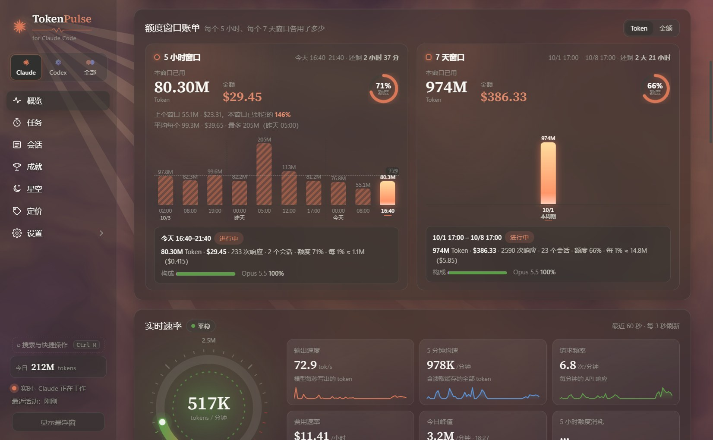

Claude 与 Codex 各自的每个 5 小时窗口、每个 7 天窗口用了多少 Token、花了多少钱。当前窗口实时累计，并与上个窗口、平均窗口和历史最高对比；悬停柱子查看该窗口的响应数、会话数、每 1% 额度约等于多少 Token，以及模型构成；点一下柱子，上方的数字就换成那个窗口（与它前一个窗口、平均窗口对比，并给出排名），再点一次回到当前窗口。可在 Token 与金额之间切换。

### 日历、今天的会话、模型对比

- **日历**：最近 12 周每天一格，颜色越深用得越多；悬停或点一天，看当天的 Token、花费、响应、会话、时间段、主力模型和项目。
- **今天的会话**：每个会话一条横条，从第一次到最后一次响应，越亮的地方那十分钟用得越多；最上面一行是同一时刻开着几个会话。点一条打开那个会话。
- **模型对比**：跟着上面的范围（今日 / 7 天 / …），每个模型的花费、Token、每百万 Token 的实际单价、每次提问平均花多少、缓存命中、输出占比和响应次数，并标出最划算的一个。

### AI 做了什么、个人纪录

- **AI 做了什么**：跟着上面的范围，Claude Code 和 Codex 调用了多少次工具：跑命令、读与搜索、改文件、联网、子代理、MCP 各占多少，常用工具排行，改得最多的文件，以及写入 / 删除的代码行（Edit 比较改前改后，Write 整个文件算作写入）。Claude Code 只保留 30 天日志，更早的工具调用看不到。
- **个人纪录**：用得最多、花得最多、提问最多、写代码最多的一天，最长连续使用，最忙的一个小时，最大的一段对话和最贵的一个问题；每项下面是今天到了纪录的多少，破纪录时会标出来。底部是每个使用日、每个问题的平均值。

### 5 小时 × 7 天

每个 5 小时窗口吃掉了多少 7 天额度：本周的 7 天额度画成一条长条，按其中每个 5 小时窗口切成一段，刻度标出用满 1、2、3… 个 5 小时窗口的位置；上方给出换算（一个满的 5 小时窗口约等于 7 天额度的百分之几、7 天额度能装下几个满窗口、这周还剩几个），下方逐个列出“5h 用了多少 → 7 天 +多少”。7 天的读数按各窗口的 API 等价花费分摊。

### 实时速率与额度预测

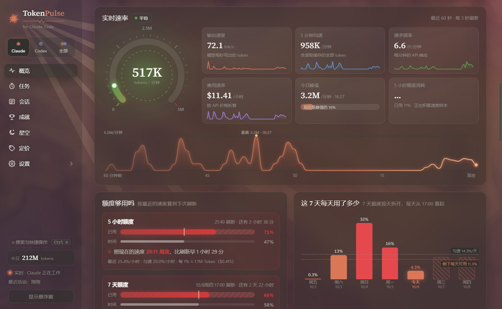

- **实时速率**：Token/分钟仪表、输出速度、5 分钟均速、请求频率、费用速率和今日峰值，附近 60 分钟的曲线。
- **额度够用吗**：对比“已用额度”和“窗口时间过了多少”，按最近的速度算出何时用完、比刷新早多久。
- **这 7 天每天用了多少**：把 7 天额度按天拆开，告诉你剩下几天每天还能用多少。

### 额度来源与额度守卫

Claude 额度有四种来源，在 **设置 → Claude 额度** 里选择：

| 来源 | 说明 |
| --- | --- |
| 自动（默认） | 用量接口为主，状态栏桥接有更新的数据时优先用它，都不可用时退回本地估算 |
| 用量接口 | Claude Code `/usage` 使用的接口，数据最全（含 Opus / Sonnet 周额度），需要本机登录令牌有效；令牌只读，不会刷新或修改 |
| 官方状态栏 | 读取 Claude Code 传给状态栏脚本的 `rate_limits`，稳定、无需令牌，每次响应后更新；需开启“状态栏桥接” |
| 本地估算 | 只看本机日志：本窗口的等价 API 费用 ÷ 窗口上限（自动用官方数据校准，也可手动填写），离线可用 |

开启状态栏桥接后，原来的状态栏脚本会照常运行，额度条和重置倒计时追加在它后面。Codex 额度每分钟从 ChatGPT 账号读取（在 设置 → Codex 额度 里登录 ChatGPT；没登录时只读使用 Codex CLI 已有的登录），读不到时用 Codex 会话日志里的 `rate_limits`。

**额度守卫**（设置 → 额度守卫）会在 Claude Code 的 `settings.json` 里加入 `PreToolUse` / `UserPromptSubmit` 钩子：

- 5 小时额度达到阈值（默认 90%，可设 50–99%）时，正在运行的任务停在下一次工具调用或新提问处等待；
- 额度重置后自动继续，也可以限定只在某个时段（例如 00:00–08:00）自动续跑；
- 可另设 7 天额度暂停线，也可以随时手动暂停 / 恢复全部或单个会话；
- 关闭守卫时钩子会被移除。

### 刷新任务

<table>
  <tr>
    <td>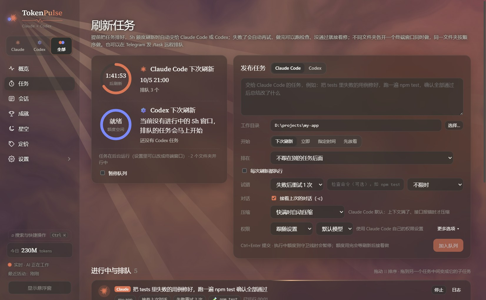</td>
    <td>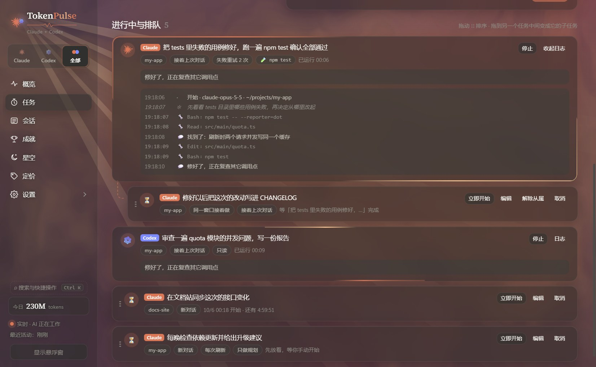</td>
  </tr>
  <tr>
    <td align="center">发布任务：开始时机、试错、对话、压缩、权限</td>
    <td align="center">队列与实时日志（截图里是演示任务）</td>
  </tr>
</table>

提前把任务排好，额度刷新时自动交给 Claude Code（`claude -p`）或 Codex（`codex exec`）无人值守执行：

- **开始时机**：下次 5 小时刷新、立即、指定时间或先放着手动开始；也可以每次刷新都执行一遍。
- **排队方式**：按工具和工作目录分道，不同文件夹同时做，同一文件夹按顺序做；拖动排序，拖到另一个任务中间变成它的子任务。
- **试错**：失败后自动重试（网络类错误逐步退避）；额度用完会等到刷新后接着原来的对话继续；填了检查命令（如 `npm test`）时，检查不通过就带着输出让它接着修。
- **对话**：可接着上次的对话（`-c --fork-session`），也可以对某次结果发起跟进。
- **限制**：每次尝试的最长时间、预算上限、备用模型、思考强度、权限 / 沙箱模式。
- **上下文压缩**：按百分比或 Token 数设置自动压缩的时机，或关闭自动压缩。
- **终端窗口**：可选在终端窗口里运行，实时看到思考、工具调用和输出；TokenPulse 重启也不会中断。
- 额度守卫暂停时任务一起等待；在 Telegram 发 `/task 内容` 也能远程排任务。

### 会话与提问

- 按项目、模型搜索会话，查看时长、响应数、上下文大小、Token 和费用；点开一行可看上下文曲线和每次提问的费用。
- 「自报 · 本次运行」是 Claude Code 自己记录的最近一次运行费用（包含子调用，会话恢复后重新计数），和按日志逐条计算的费用分开显示。
- Claude Code 默认只保留 30 天日志；开启 **历史归档** 后 TokenPulse 会把解析出的用量另存一份，“全部”范围可以一直往前看。

### 星空

<table>
  <tr>
    <td>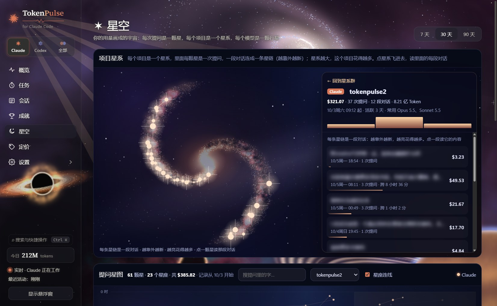</td>
    <td>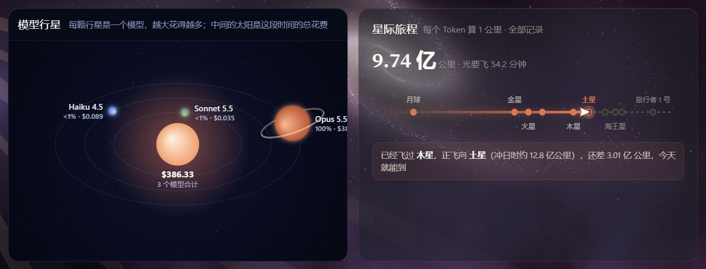</td>
  </tr>
  <tr>
    <td align="center">飞进一个项目星系，读其中的每段对话（提问内容已模糊）</td>
    <td align="center">模型行星与星际旅程</td>
  </tr>
</table>

把用量画成宇宙：每个项目是一个星系，每次提问是一颗星，一段对话连成一条星链，越靠外越新、越亮花得越多。点进星系可以按对话浏览，并读回完整的提问、回复和工具调用。此外还有提问星图、模型行星（每颗行星是一个模型，太阳是总花费）、星际旅程（每个 Token 算 1 公里）和今日星座。

### 塔罗

22 张大阿卡纳，每张都是你用量的一幅画，用牌本来的画面画出来，点牌翻到背面看具体数字：

| 牌 | 画的是 | 牌 | 画的是 |
| --- | --- | --- | --- |
| 太阳 | 24 道光 = 今天每个小时的用量 | 月亮 | 月相 = 7 天额度用了多少，露珠 = 离刷新的天数 |
| 命运之轮 | 每一格 = 这周的一个 5 小时窗口 | 高塔 | 塔高 = 今天最快的一分钟，破纪录被闪电劈中 |
| 星星 | 8 颗星 = 这 7 天用得最多的项目 | 节制 | 两只杯子 = 5 小时与 7 天额度的水位 |
| 皇帝 | 权杖 = 5 小时额度和守卫线 | 世界 | 花环 30 片叶子 = 最近 30 天 |

其余还有愚者（用过的每一天）、魔术师（输入 / 输出 / 缓存的比例）、女祭司（缓存命中）、皇后（7 天的输出）、教皇（你的作息）、恋人（Claude 与 Codex）、战车（当前速度）、力量（连续天数）、隐士（深夜用量）、正义（本周与上周花费）、倒吊人（没用完的额度）、死神（今天结束的对话）、恶魔（最贵的提问）、审判（刷新任务）。牌随用量实时变化，点一张翻到背面看具体数字。Telegram 发 `/tarot` 收到其中 6 张的图片。

### 成就

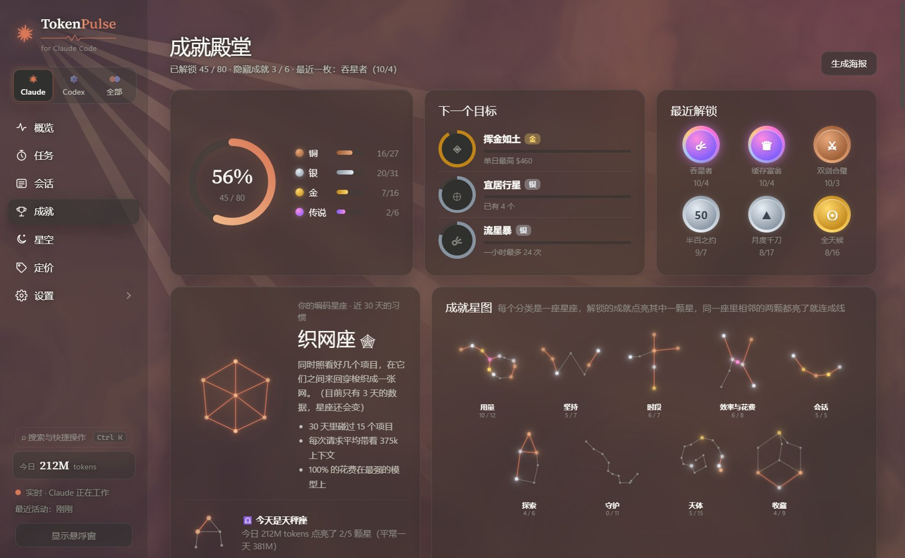

82 个分为铜、银、金、传说四档的成就，包括收集类和解锁前看不到的隐藏成就。每个分类是一座星座，解锁的成就点亮其中一颗星；还有根据近 30 天习惯推算的“编码星座”，可以生成海报分享。

### 定价

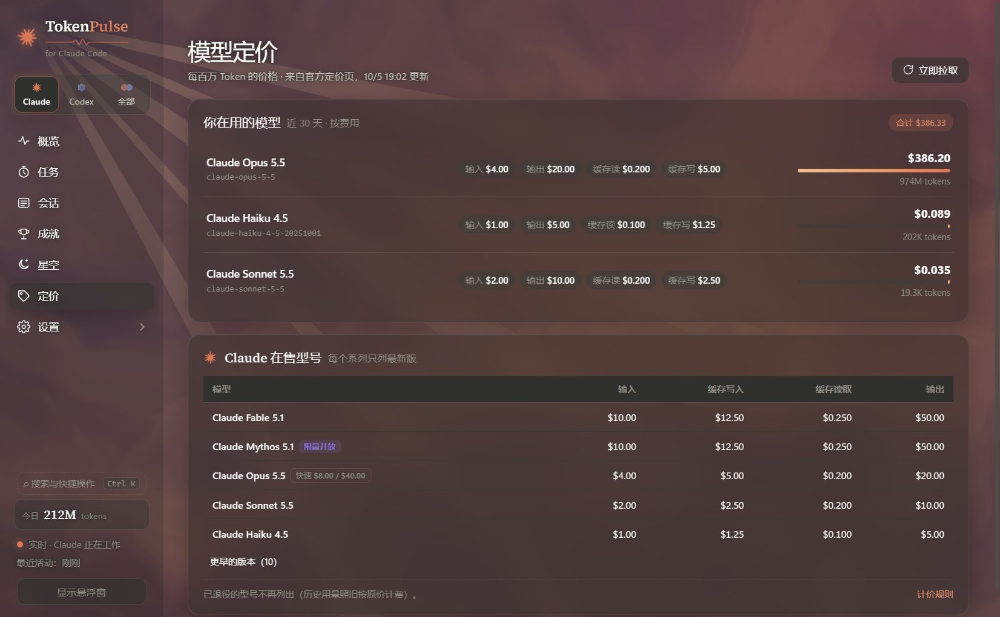

费用按日志中每条响应的用量和模型价格计算。价格来自 Anthropic 官方定价页与 LiteLLM 价格表，内置一份离线价格兜底；页面列出你近 30 天在用的模型和各系列在售的最新型号，已退役的型号仍按原价计费。GPT 系列模型同样计价。

### 主题包与动态背景

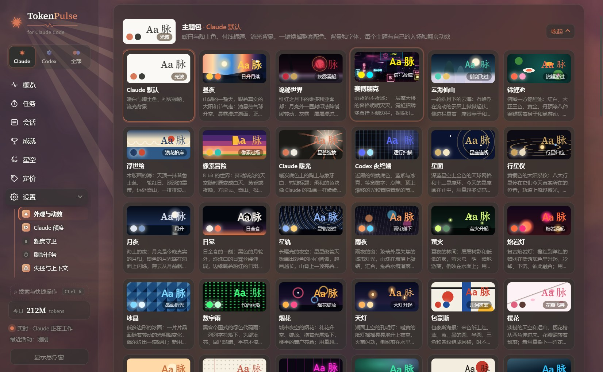

30 个主题包，每个都有自己的动态背景、配色、字体和入场动效；在设置里把指针停在主题包或背景上，就能预览它的实时动画。动效强度、帧率上限（30 / 60 / 不限）、背景鲜明度、玻璃卡片和光影特效都可以调整。

<table>
  <tr>
    <td></td>
    <td></td>
    <td>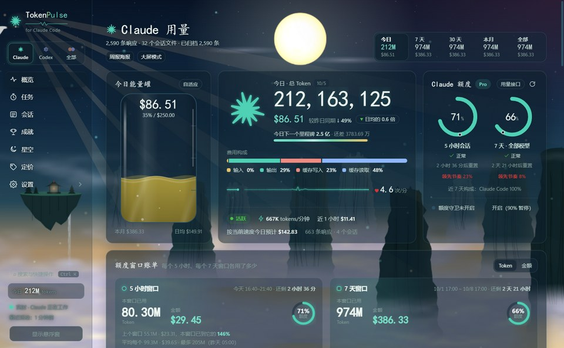</td>
  </tr>
  <tr><td align="center">诡秘世界</td><td align="center">赛博朋克</td><td align="center">云海仙山</td></tr>
  <tr>
    <td>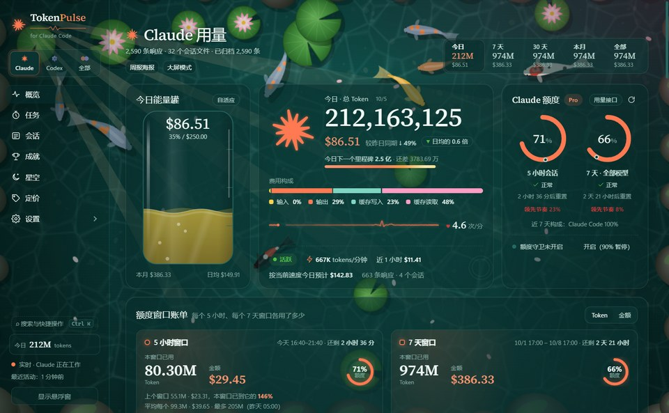</td>
    <td>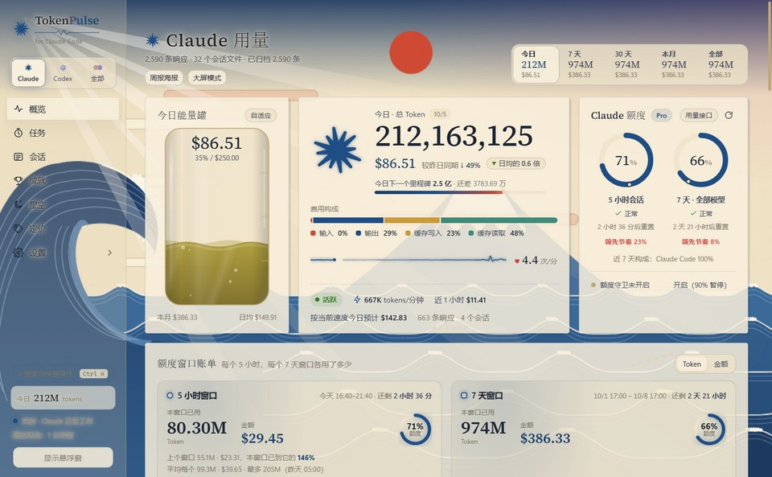</td>
    <td>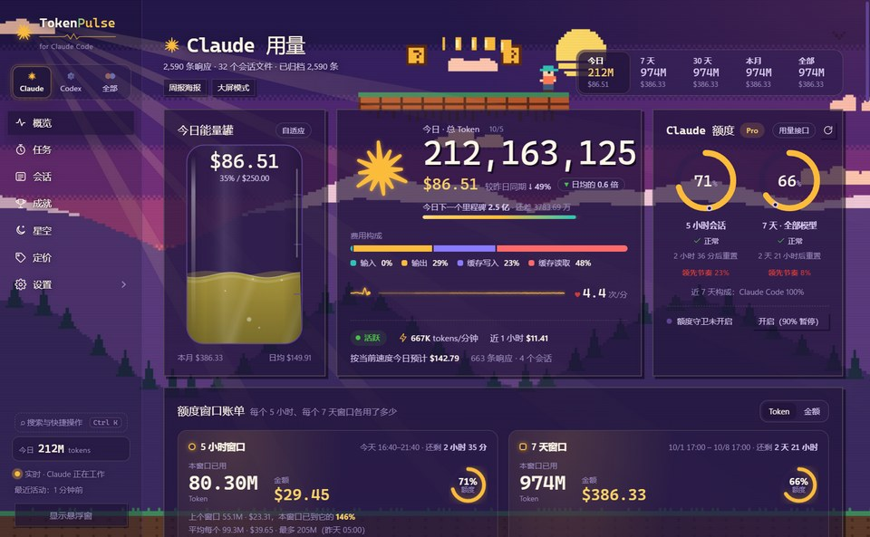</td>
  </tr>
  <tr><td align="center">锦鲤池</td><td align="center">浮世绘</td><td align="center">像素冒险</td></tr>
  <tr>
    <td></td>
    <td>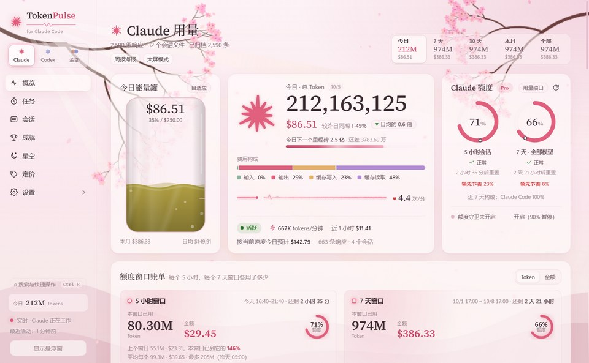</td>
    <td>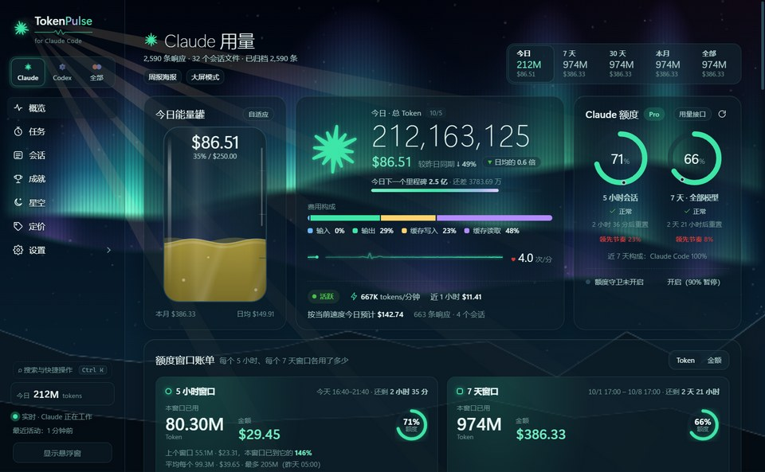</td>
  </tr>
  <tr><td align="center">天灯</td><td align="center">樱花</td><td align="center">北欧极光</td></tr>
  <tr>
    <td>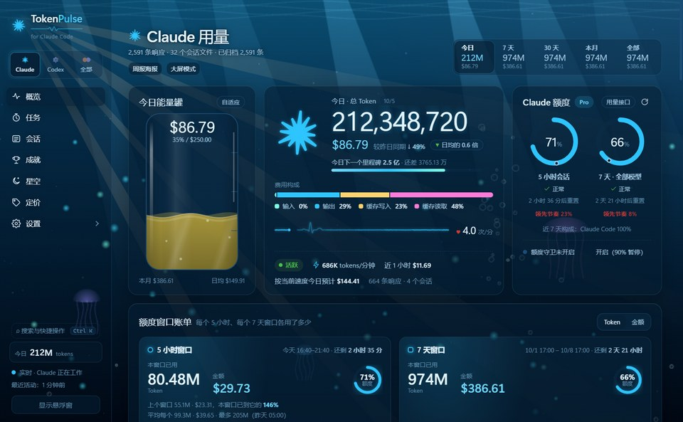</td>
    <td>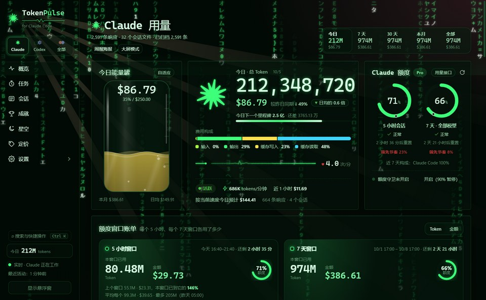</td>
    <td></td>
  </tr>
  <tr><td align="center">深海</td><td align="center">数字雨</td><td align="center">行星仪</td></tr>
</table>

全部主题包：Claude 默认、昼夜、诡秘世界、赛博朋克、云海仙山、锦鲤池、浮世绘、像素冒险、Claude 暖光、Codex 夜终端、星图、行星仪、月夜、日冕、星轨、雨夜、萤火、熔岩灯、冰晶、数字雨、烟花、天灯、包豪斯、樱花、沙丘、纸笺手账、赛博霓虹、北欧极光、墨水纸本、深海。也可以设置日出、日落时自动在两个主题之间切换。

### 昼夜主题

<table>
  <tr>
    <td>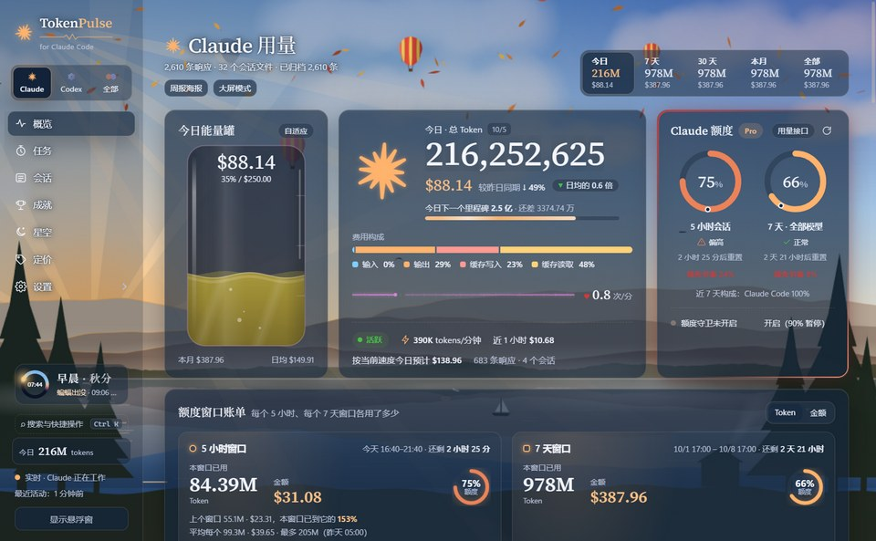</td>
    <td>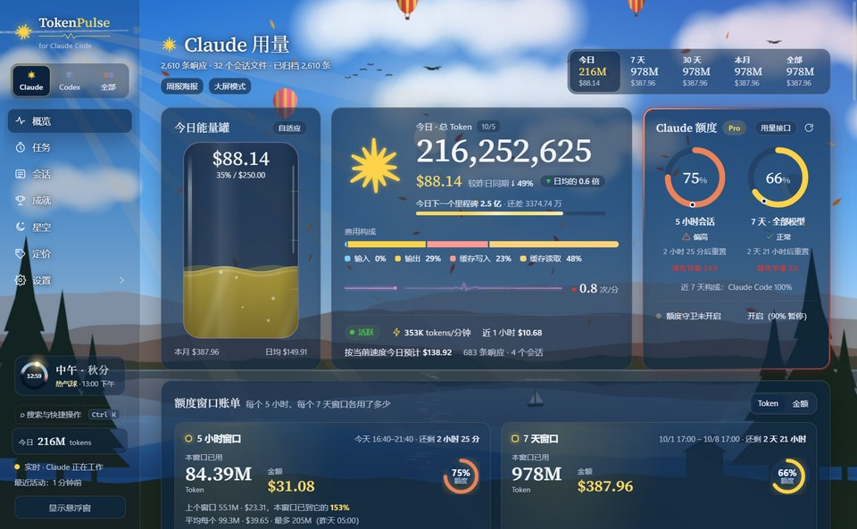</td>
    <td>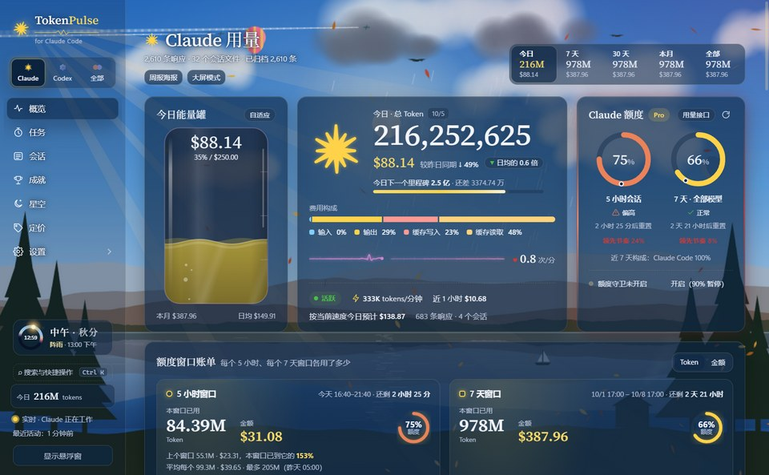</td>
  </tr>
  <tr><td align="center">早晨 · 热气球</td><td align="center">中午 · 航迹与盘旋的鹰</td><td align="center">过云雨</td></tr>
  <tr>
    <td></td>
    <td></td>
    <td>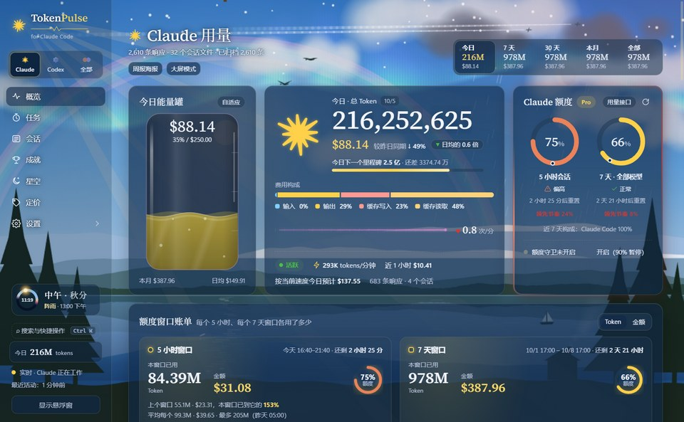</td>
  </tr>
  <tr><td align="center">黄昏 · 蝙蝠</td><td align="center">深夜 · 极光与卫星</td><td align="center">冬日</td></tr>
</table>

按所在城市的真实太阳位置在早晨、中午、傍晚、深夜之间渐变，界面配色随之变化。场景里有热气球、航迹、盘旋的鹰、过云雨与彩虹、蝙蝠、卫星、萤火；夜里用量繁忙时会出现极光；花絮、落叶和雪按二十四节气飘落。侧边栏的小钟显示当前时段和节气。

### 悬浮窗与灵动岛

<table>
  <tr>
    <th></th><th>卡片</th><th>胶囊</th><th>圆球</th><th>灵动岛</th>
  </tr>
  <tr>
    <td>赛博朋克</td>
    <td>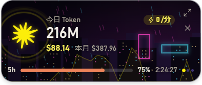</td>
    <td></td>
    <td>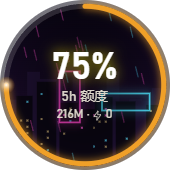</td>
    <td>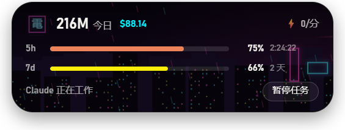</td>
  </tr>
  <tr>
    <td>浮世绘</td>
    <td>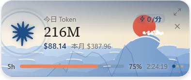</td>
    <td></td>
    <td>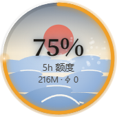</td>
    <td>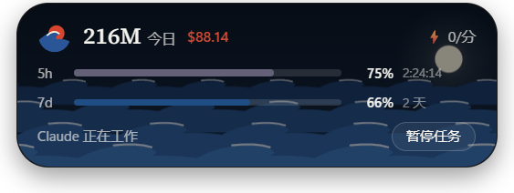</td>
  </tr>
  <tr>
    <td>锦鲤池</td>
    <td>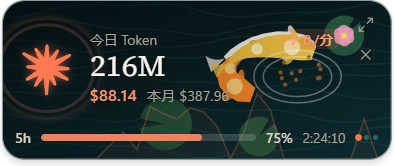</td>
    <td>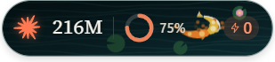</td>
    <td>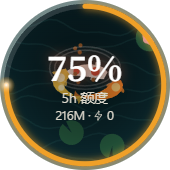</td>
    <td>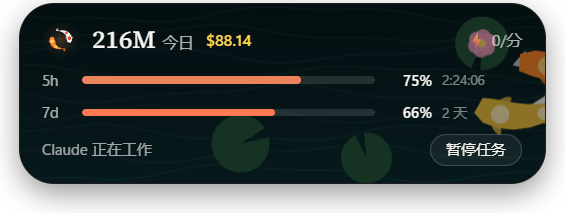</td>
  </tr>
  <tr>
    <td>昼夜</td>
    <td>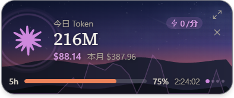</td>
    <td></td>
    <td>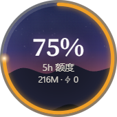</td>
    <td>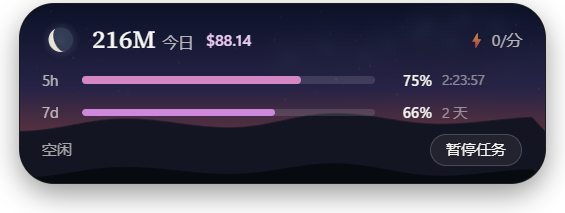</td>
  </tr>
  <tr>
    <td>诡秘世界</td>
    <td>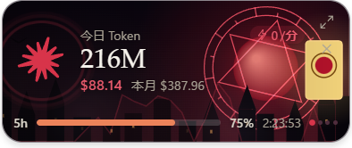</td>
    <td></td>
    <td>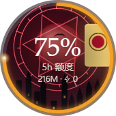</td>
    <td>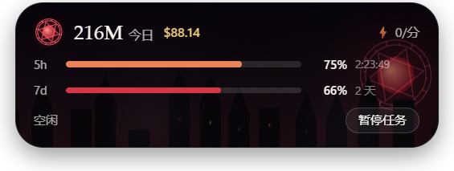</td>
  </tr>
</table>

- **悬浮窗**：置顶的迷你窗口，可拖动，拖到屏幕边缘自动吸附，可贴边隐藏、鼠标穿透，调大小和不透明度；右键可快速切换样式。卡片显示今日用量、速率、费用并轮播额度；胶囊只占一条；圆球的水位就是 5 小时额度。
- **灵动岛**：屏幕顶部正中的胶囊，平时显示今日用量和 5 小时额度，额度提醒、守卫暂停、失控会话、任务完成时会展开；指针移上去可看详情、暂停任务。
- 每个主题包在悬浮窗和灵动岛里也有自己的场景与徽记，新用量到来时各有回应。
- 托盘图标随用量变化；还可以把当前动态背景铺成桌面壁纸，桌面图标照常显示。

### 提醒、通知与 Telegram

- **预算**：每日、每月预算用到 80% 和 100% 时提醒。
- **额度**：额度提醒；5 小时窗口快刷新时还剩很多额度会提醒你别浪费，并可提前开始刷新任务。
- **上下文膨胀**：按模型的上下文窗口判断，接近上限时提醒。
- **失控检测**：以你过去 7 天的正常强度为基准，某个会话短时间内消耗远超平时，或连续十几次输出相同内容时提醒，可选择暂停该会话。
- 成就解锁、任务结果、守卫暂停与恢复也会通知，可配音效。

**Telegram**（设置 → 通知与 Telegram）：填入机器人令牌并自动识别对话后，上述通知会推送到手机，每晚可收到晚报，还能在 Telegram 里发指令（网络走系统代理）：

| 指令 | 作用 | 指令 | 作用 |
| --- | --- | --- | --- |
| `/status` | 额度与运行状态 | `/pause` | 暂停所有 Claude Code 任务 |
| `/today` | 今日用量 | `/resume` | 恢复暂停的任务 |
| `/week` | 最近 7 天用量走势 | `/guard` | 额度守卫开关 |
| `/top` | 今天最贵的提问 | `/tasks` | 刷新任务队列（可开始、停止、取消） |
| `/star` | 5h 恒星、7 天轨道与星骸 | `/task 内容` | 排一个任务到下次 5h 刷新 |
| `/sign` | 今天的编码星座 | `/log` | 正在执行（或最近）的任务日志 |
| `/ach` | 成就进度 | `/report` | 立即发送今日晚报 |
| `/panel` | 控制面板：一条消息里翻页，可收成一行 | `/card` | 今日卡片（图片） |
| `/luck` | 🎰 今日额度运势 | `/board on/off` | 置顶实时看板 |
| `/keys` | 拿回输入框下的按钮 | `/hide` | 收起按钮 |

开启动画后：`/card` 发来的今日卡片是一段循环动图（数字滚动上涨、额度环填满、24 小时的柱子一根根长出来），额度到 75% / 90% / 用完和刷新时的提醒配一段仪表动画，`/status`、`/today` 的回复先转一圈月相再一格格涨到真实数值。

输入框下面只留一行按钮（面板 / 状态 / 任务 / 卡片），默认点一下就自动收起，点输入框旁的 ⌨️ 再展开；也可以在设置里改成常驻或不要按钮。长回复的细节折叠在可展开的引用里；直接发「状态」「卡片」这类词也能当指令，其他文字可以一键排成任务。成就解锁、任务完成、额度爆表会带全屏特效，晚报可附一张今日卡片，推送可设免打扰时段。

### 快捷键

| 按键 | 作用 |
| --- | --- |
| `Ctrl` + `1`–`8` | 切换到概览、任务、会话、成就、星空、塔罗、定价、设置 |
| `Ctrl` + `K` | 搜索页面、设置项与快捷操作，切换主题包和背景 |
| `Ctrl` + `M` | 显示 / 隐藏悬浮窗 |
| `F5` | 刷新额度 |
| `F11` | 大屏模式（`Esc` 退出） |
| `Ctrl` + `Alt` + `T` | 全局显示 / 隐藏悬浮窗（被其他程序占用时自动改用 `Ctrl` + `Alt` + `K` 等备选） |

## 数据与隐私

TokenPulse 不需要账号，没有任何统计上报。

**读取**

- Claude Code 与 Codex 的会话日志（见[使用前提](#下载与安装)）。
- `~/.claude/.credentials.json` 中的登录令牌，只用于查询订阅额度，只读，从不刷新或改写。
- `~/.codex/auth.json` 中 Codex CLI 的登录令牌（没有在 TokenPulse 里登录 ChatGPT 时），只用于查询 Codex 额度，只读，从不刷新或改写。

**写入**

- `%APPDATA%\TokenPulse`：设置、历史归档、额度窗口记录、任务和成就进度；在 TokenPulse 里登录 ChatGPT 时，令牌用 Windows 数据保护加密后存在这里；下载的更新也先放在这里。
- `~/.claude/tokenpulse`：额度守卫与状态栏桥接的脚本和额度读数。
- `~/.claude/settings.json`：仅在开启额度守卫或状态栏桥接时写入对应的钩子 / 状态栏项，关闭时移除并恢复原来的状态栏。

**联网**

| 地址 | 用途 |
| --- | --- |
| `api.anthropic.com/api/oauth/usage` | 查询 Claude 订阅额度（可改用官方状态栏或本地估算） |
| `platform.claude.com` 定价页、GitHub 上的 LiteLLM 价格表 | 更新模型价格 |
| `api.telegram.org` | 仅在开启 Telegram 时 |
| `chatgpt.com`、`auth.openai.com` | 读取 Codex 额度、登录 ChatGPT 时 |
| `api.github.com`、`github.com` | 检查与下载更新（可在设置里关闭） |

## 命令行额度工具 tpq

仓库里的 `src/bridge/quota.cjs` 是一个独立的命令行工具，在终端里查看 Claude 订阅额度：

```powershell
node src/bridge/quota.cjs            # 额度面板
node src/bridge/quota.cjs --watch    # 持续刷新
node src/bridge/quota.cjs --line     # 单行输出，适合放进提示符
node src/bridge/quota.cjs --json     # JSON 输出
node src/bridge/quota.cjs install    # 在 Claude Code 状态栏显示额度，并添加 tpq 命令
node src/bridge/quota.cjs uninstall  # 撤销 install
```

读数缓存 1 分钟并遵守接口限流；接口不可用时显示 TokenPulse 或状态栏桥接最近保存的读数。

## 本地开发

需要 Node.js 与 npm。Windows 下双击根目录的 `start.bat`，或运行：

```powershell
npm ci
npm run dev
```

常用检查与打包命令：

```powershell
npm run typecheck
npm test
npm run build
npm run dist -- --publish never
```

打包结果位于 `dist/`。如果下载 Electron 失败，可设置镜像 `ELECTRON_MIRROR=https://npmmirror.com/mirrors/electron/`；打包时下载失败可先 `npm run build`，再用已安装的 Electron 打包：`npx electron-builder --win -c.electronDist=node_modules/electron/dist`。

### 项目结构

| 目录 | 内容 |
| --- | --- |
| `src/main/` | Electron 主进程：日志采集、费用与额度计算、守卫、任务、通知、Telegram、窗口管理 |
| `src/preload/` | 主进程与界面之间的桌面接口桥接 |
| `src/renderer/` | React 界面：页面、图表、主题场景、悬浮窗与灵动岛 |
| `src/shared/` | 主进程与界面共用的类型、主题包定义、天文与昼夜计算 |
| `src/bridge/` | 独立运行的脚本：额度守卫钩子、状态栏桥接、`tpq`、任务终端窗口 |
| `tests/` | Vitest 测试 |
| `docs/screenshots/` | README 截图 |

### 重新生成截图

README 的截图由开发用的自动巡览生成。它使用独立的配置目录和独立的 Claude 设置目录，不会改动你真实的设置、守卫和任务，但会读取本机真实的用量日志：

```powershell
npm run build
$env:TP_SCREENSHOT = "$env:TEMP\tp-shots"; $env:TP_SHOTS = "readme"
npx electron .
```

图片输出到 `%TEMP%\tp-shots\readme`，挑选后复制到 `docs/screenshots/`。设置 `TP_SHOTS_ONLY`（`pages`、`tasks`、`packs`、`day`、`pockets`，可用逗号组合）可以只拍其中几组；任务页用的是演示任务和替身命令，不会真的调用 Claude Code。

本地日志、依赖、构建产物、环境变量文件与私钥不提交到 Git，配置示例请使用占位符。

## 更新记录

### v2.18.0
- 概览新增「AI 做了什么」：所选时间段里 Claude Code 和 Codex 调用工具的次数，跑了多少命令、读了多少次代码、改了多少个文件、写入和删除了多少行，按类型的占比、常用工具排行和改得最多的文件。
- 概览新增「个人纪录」：用得最多 / 花得最多 / 提问最多 / 写代码最多的一天、最长连续使用、最忙的一个小时、最大的一段对话、最贵的一个问题，每项显示今天到了纪录的多少；底部是每个使用日和每个问题的平均值。
- 设置里不再显示更新说明，新版本的更新内容只在启动时的弹窗里展示。

### v2.17.0
- 每次打开 TokenPulse 都会检查 GitHub Releases；发现新版本时弹窗展示更新内容（Markdown 排版：标题、列表、代码、链接、表格），点「立即更新」后下载、校验 SHA-256 并自动重启到新版本，也可以转到后台下载或稍后再说。不再定时检查、不再静默下载。
- 设置 → 系统与数据里的更新说明同样按 Markdown 显示；侧边栏的「可更新 / 已就绪」提示点开就是更新弹窗。
- 塔罗牌下面和背面的说明文字去掉了，只留牌名。

### v2.16.0
- 塔罗改为 22 张「数据牌」：每张牌用自己的画面画出一部分用量（太阳 = 今天 24 小时，月亮 = 7 天额度，命运之轮 = 这周的 5 小时窗口……），随用量实时变化，点牌翻到背面看数字。
- 概览新增日历（12 周）、今天的会话时间线、模型对比表。
- Telegram 动画：今日卡片是循环动图，额度提醒配仪表动画，`/status`、`/today` 逐帧展开；可在设置里关掉。

### v2.15.2
- 安装程序改为中文，并在选择安装位置后多一页「创建桌面快捷方式」（默认勾选）；自动更新的静默安装不会改动已有的快捷方式。
- 昼夜主题侧边栏时钟的副标题改为显示现在的时间（下一个时段改到悬停提示里）。

### v2.15.1
- 自动更新：启动后和每 6 小时从 GitHub Releases 检查新版本，后台下载并按 `SHA256SUMS.txt` 校验；点「重启并更新」后，便携版原地替换当前的 exe（快捷方式和开机自启不受影响），安装版静默安装后重启。
- Codex 额度：可以在设置里登录 ChatGPT（和 `codex login` 同一套 OAuth，令牌加密存在本机），每分钟从账号读取 5 小时 / 7 天额度；没登录时只读使用 Codex CLI 已有的登录。修复新版 Codex 日志里多出的空 `premium` 额度记录把 Codex 额度清空的问题。
- 「塔罗」页：你问出的每个问题翻开一张大阿卡纳；牌阵是今天的第一个问题、刚刚的问题和下一个问题会翻开的牌，另有今日手牌和牌谱；22 张手绘金线卡面；Telegram `/tarot`。
- 概览新增「5 小时 × 7 天」：每个 5 小时窗口占了多少 7 天额度，以及满窗口的换算。
- 额度窗口账单：点柱子在上方查看那个窗口。
- 实时速率加上限速口径的 TPM（输入 / 输出，不含缓存读取）。
- 标题栏按钮按角落里的真实像素选色，必要时在按钮后面铺一层主题色的柔光，任何背景下都看得清。
- Telegram：输入框下的按钮只剩一行并且可以收起（设置里可改为常驻或不要），新增可翻页、可收成一行的控制面板 `/panel`、今日卡片图片 `/card`、置顶实时看板、免打扰时段、全屏特效与表情回应、`/luck`，长回复折叠，普通文字可一键排成任务。

### v2.12.1
- 设置、刷新任务、额度窗口记录和 Claude Code 的 `settings.json` 改为整份写入：关机或崩溃时不会留下写了一半的文件，连续保存时最新的内容一定落盘。
- 退出时把还没写出的成就计数和额度窗口读数立即保存。
- `settings.json` 开头带 BOM（有些编辑器会加）也能正常读取；设置或任务列表读不出来时先另存为 `.broken`，不会被下一次保存覆盖。
- 帧率显示补全标题流光和悬浮窗场景的名称。

### v2.12.0
- 每个主题包在悬浮窗（卡片、胶囊、圆球）和灵动岛里都有自己的场景与徽记，新用量到来时各有回应。
- 概览新增“额度窗口账单”：Claude 与 Codex 各自每个 5 小时、7 天窗口用了多少 Token 和费用，与上个窗口、平均窗口对比。
- 动画统一按屏幕刷新等间隔出帧，可设 30 / 60 帧上限或不限，自动模式在掉帧时降低场景分辨率；可打开右下角的帧率显示。
- 昼夜主题的时钟改为正午朝上、标出凌晨到深夜各时段；标题栏按钮按所在角落的明暗自动换色。
- 修复侧边栏展开设置分组后无法滚到底部的问题。

### v2.11.0
- 新增 6 个主题包：诡秘世界、赛博朋克、云海仙山、锦鲤池、浮世绘、像素冒险。
- 昼夜主题加入热气球、航迹、鹰、过云雨与彩虹、蝙蝠、卫星、萤火、极光、四季飘落物，并跟随二十四节气。
- 在设置里把指针停在主题包或背景上即可预览实时动画。

### v2.10.0
- 星空里的项目星系可以飞进去，按对话浏览并读回提问、回复与工具调用。
- 将当前源码作为 GitHub 发布快照，提供 Windows x64 安装版与便携版；补齐功能说明、开发与打包步骤、MIT 许可证和一键启动脚本。

## 许可证

[MIT](LICENSE)
